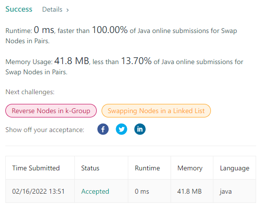
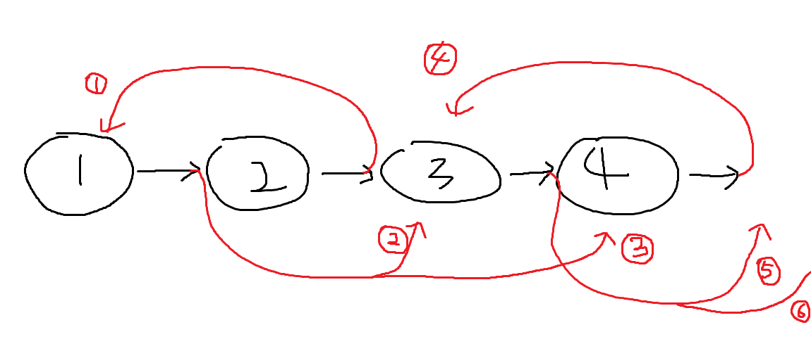

# 24. Swap Nodes in Pairs
[문제 링크](https://leetcode.com/problems/swap-nodes-in-pairs/ )   
[풀이 링크](SwapNodesInPairs.java )  

## 문제 설명
단방향 연결 리스트의 인접한 두 노드를 모두 스왑하고, `head`를 반환하라.  
노드의 값을 수정하지 않고, 노드 자체만을 가지고 해결하라.  

**예시**
```
input:  head = [1,2,3,4]
output: [2,1,4,3]

input:  head = []
output: []

input:  head = [1]
output: [1]
```

입력 범위:  
`리스트의 길이의 범위는 [0, 100]이다.`  
`0 <= node.val <= 100`  

## 풀이
  
리트코드 문제를 풀면서 처음으로 나온 상위 0%...  

  
이전 노드를 가리키는 `pre`, 현재 노드를 가리키는 `cur`, 다음 노드를 가리키는 `next`를 두었다.  
1. `pre`가 가리키는 노드를 `next`로 바꾼다.  
2. `cur`가 가리키는 노드를 `next`가 가리키는 노드로 바꾼다.  
3. `next`가 가리키는 노드를 `cur`로 바꾼다.  
바꾼 뒤 `cur` 또는 `next`가 가리키는 노드가 `null`이면 종료한다.  
4. `pre`, `cur`, `next`를 각자 다음 노드로 옮긴다.  
