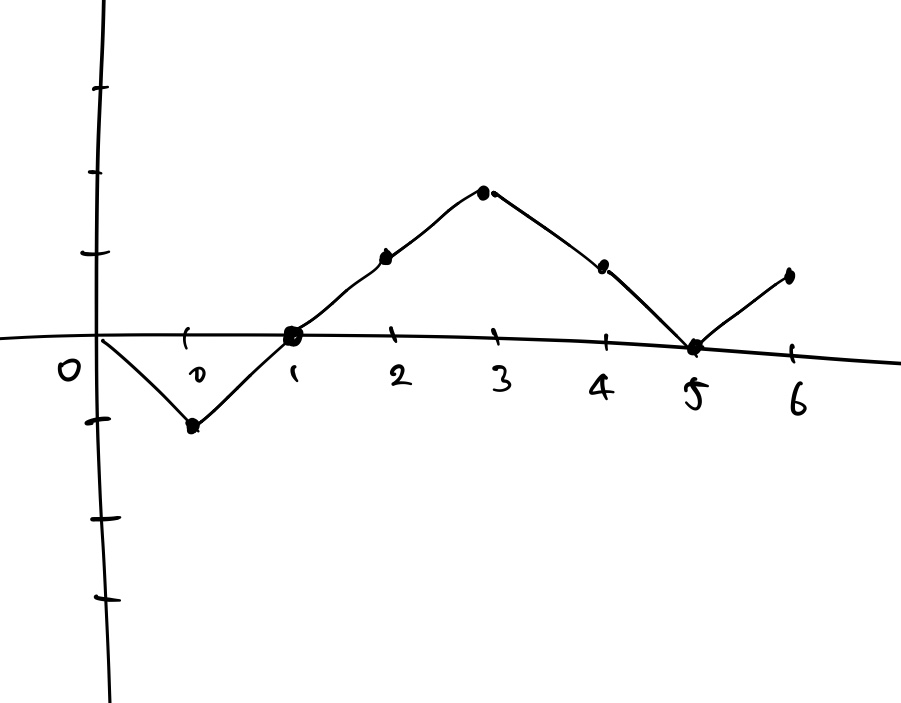

# 525. Contiguous Array
[문제 링크](https://leetcode.com/problems/contiguous-array/ )  
[풀이 링크](contiguous-array.py )  

## 문제 설명
`0`과 `1`로 이루어진 배열 `nums`가 있다.  
같은 개수의 `0`과 `1`로 이루어진 부분 배열의 최대 길이를 구하라.  

**예시**
```
nums = [0, 1] --> 2 ([0, 1])
nums = [0, 1, 1, 1, 0, 0, 1] --> 6 ([0, 1, 1, 1, 0, 0])
```

## 풀이
예시의 두 번째 경우를 예로 들자.  
각 인덱스의 값에 대해 `0`이면 아래 방향으로, `1`이면 위 방향으로 한 칸 움직이도록 그래프를 그리면 다음과 같다.  

  

```
nums[0] = 0 --> -1
nums[1] = 1 -->  0
nums[2] = 1 -->  1
nums[3] = 1 -->  2
nums[4] = 0 -->  1
nums[5] = 0 -->  0
nums[6] = 1 -->  1
```
한 번 등장한 y 좌표가 다시 등장했으면, 그 사이의 x축 방향의 거리가 부분 배열의 길이가 된다.  
위 그래프에서는 y좌표가 0인 점이 원점, `[1, 0]`, `[5, 0]`에 등장했으므로 부분 배열의 길이는 각각 2, 4, 6이 되고, 이 중 최댓값인 6이 지금까지 등장한 모든 부분 배열의 최대 길이가 된다.  
다음으로는 y좌표가 1인점이 `[2, 0]`, `[4, 0]`, `[6, 0]`에 등장했으므로 부분 배열의 길이는 2, 2, 4가 되지만 지금까지 등장한 모든 부분 배열의 최대 길이가 되지는 않는다.  
위와 같은 방법으로 부분 배열의 최대 길이를 구하면 된다.  
