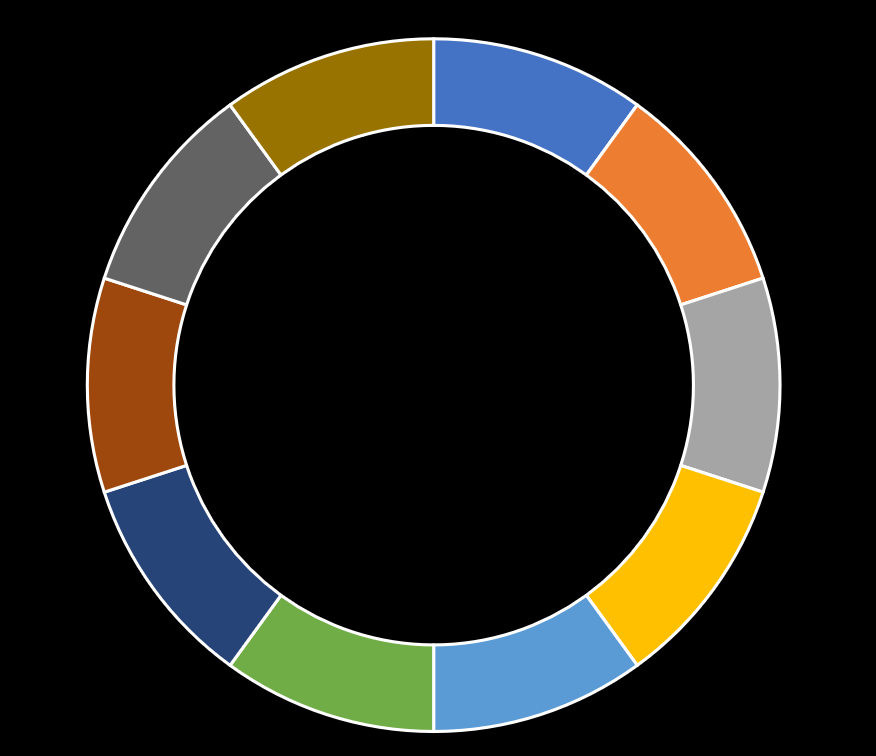

# 213. House Robber II
[문제 링크](https://leetcode.com/problems/house-robber-ii/ )  
[풀이 링크](house-robber-ii.py )  

## 문제 설명
[House Robber](house-robber.md)와 같은 상황인데, 집들이 원형으로 이어져 있다는 조건이 추가되었다. 즉, 첫 집을 털면 마지막 집을 털 수 없고, 마지막 집을 털면 첫 집을 털 수 없다.  
훔칠 수 있는 돈의 최댓값을 리턴하는 함수를 작성하라.    

## 풀이
집이 이렇게 위치해 있다고 하자.

다음과 같이 두 개의 구역으로 나눌 수 있다.  

  
  

이렇게 나누고 생각하면 원형이 아닌 그냥 두 개의 리스트가 된다.  
이 두 구간에서의 최댓값을 구하고, 그 중 더 큰 값이 정답이 된다.  
