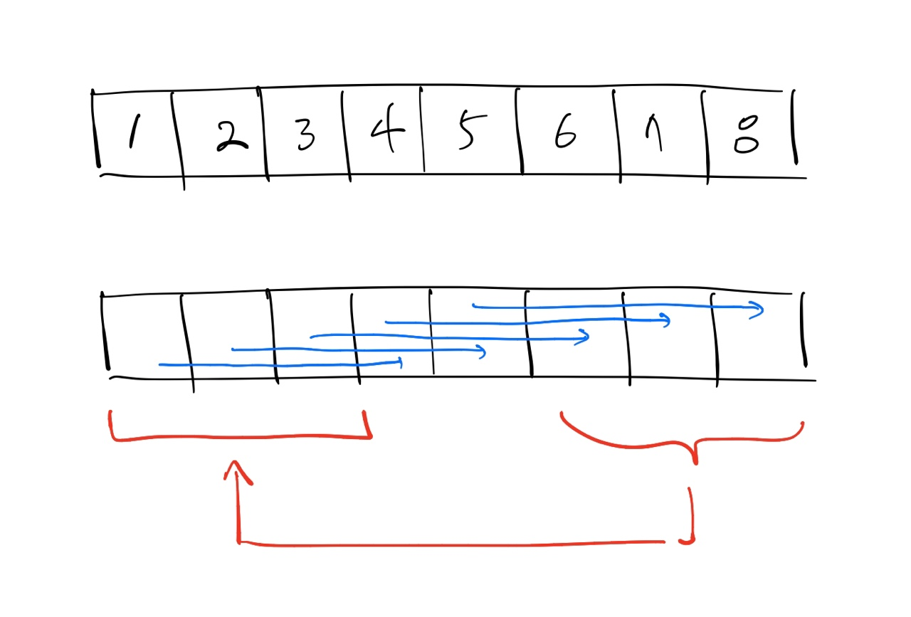

# rotate-array
[문제 링크](https://leetcode.com/problems/rotate-array/ )   
[풀이 링크](rotate-array.py )  

## 문제 설명
인자로 주어진 배열을 오른쪽으로 k칸 회전시키는 함수를 작성하라.    

입력 범위:  
`1 <= nums.length <= 10^4`  
`-2^31 <= nums[i] <= 2^31 - 1`  
`0 <= k <= 10^5`

## 풀이
공간 복잡도를 고려하지 않고 풀면 쉽다. 그냥 `nums[k:]`와 `nums[:k]`를 붙여서 그대로 원본에 복사하면 된다.  
공간 복잡도를 고려하고 풀면 다음과 같다.  

k의 값이 배열의 길이보다 큰 경우 배열의 길이에 맞게 자른다.  
배열을 오른쪽으로 회전시켜야 하므로 맨 오른쪽 k칸의 원소를 빼 둔다.  
배열의 맨 오른쪽부터 k번째 인덱스까지의 원소를 복사해가며 채운다. 즉, 뒤에서부터 len-k칸을 채운다.  
오른쪽 len-k칸을 전부 채웠으면 복사해 둔 k칸의 원소를 원본 배열의 앞 k칸에 복사한다.  

