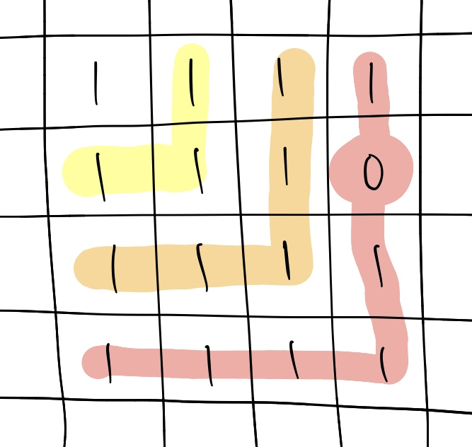
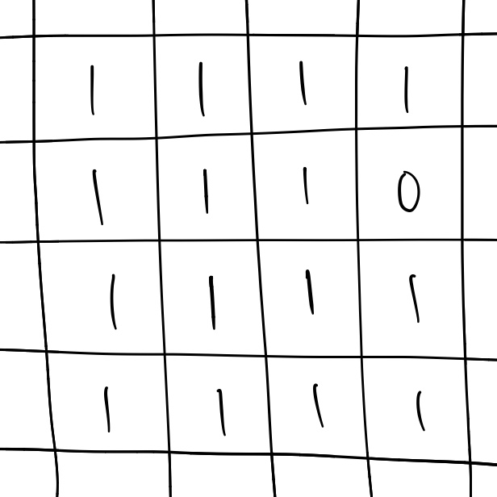
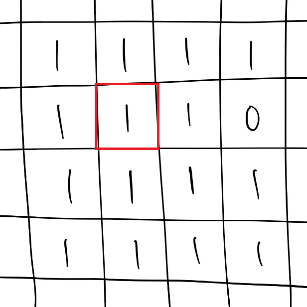
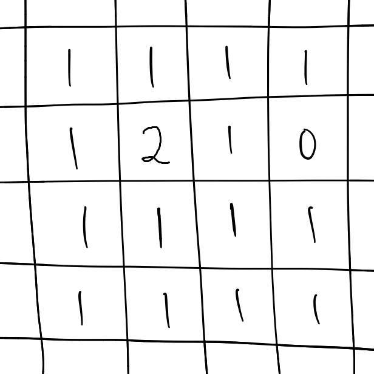
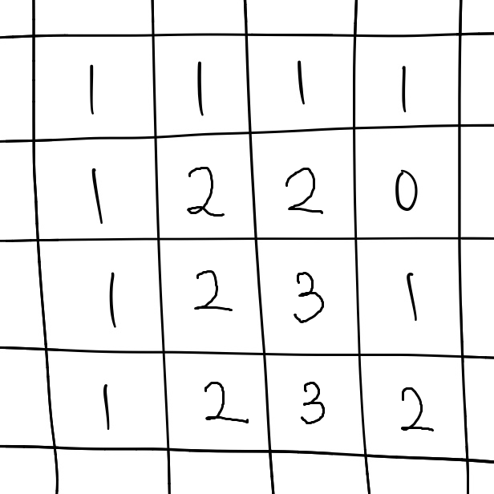

# 가장 큰 정사각형 찾기
[문제 링크](https://programmers.co.kr/learn/courses/30/lessons/12905 )  
[풀이 링크](find-the-biggest-square.py )  

## 문제 설명
`1`과 `0`으로 채워진 표 `board`가 있다. 1로 이루어진 가장 큰 정사각형의 넓이를 구하라.  

**제한사항**
* `1 <= 행의 수 <= 1,000`  
* `1 <= 열의 수 <= 1,000`  

## 풀이
### brute force
`board`의 맨 왼쪽 위부터 맨 오른쪽 아래까지 한 칸씩 순회한다.  
1을 발견하면 왼쪽 아래 방향으로 0이 없는지 검사해, 0이 있으면 그 직전까지를 정사각형의 넓이로 친다.  
아래 그림과 같은 경우는 넓이가 3이 된다.  

  

찾아낸 모든 넓이 중 최댓값을 구하면 된다.  

### dp
현재 칸까지의 넓이를 기억해 나가면서 구한다.  
`[1, 1]`번째 칸부터 `[m, n]`번째 칸까지 진행한다.  
현재 칸이 0이 아니라면, 왼쪽 칸, 왼쪽 위 칸, 위 칸에 기록된 해당 칸까지의 넓이 중 최솟값 + 1을 현재 칸까지의 넓이로 기록할 수 있다.  
그림으로 예시를 들어 보자.  

  

`[1, 1]`번째 칸을 본다.  

  

왼쪽, 왼쪽 위, 위 칸 중 최솟값이 1이므로, 현재 칸까지의 넓이는 1 + 1 = 2가 된다.  

  

같은 방법으로 쭉 진행하다 보면 다음과 같은 상태가 된다.  

  

이 중 최댓값인 3이 `board` 안에 있는 가장 큰 정사각형의 넓이가 된다.  
